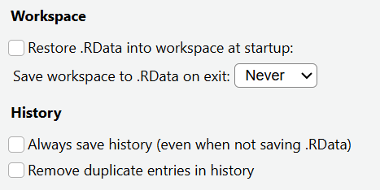
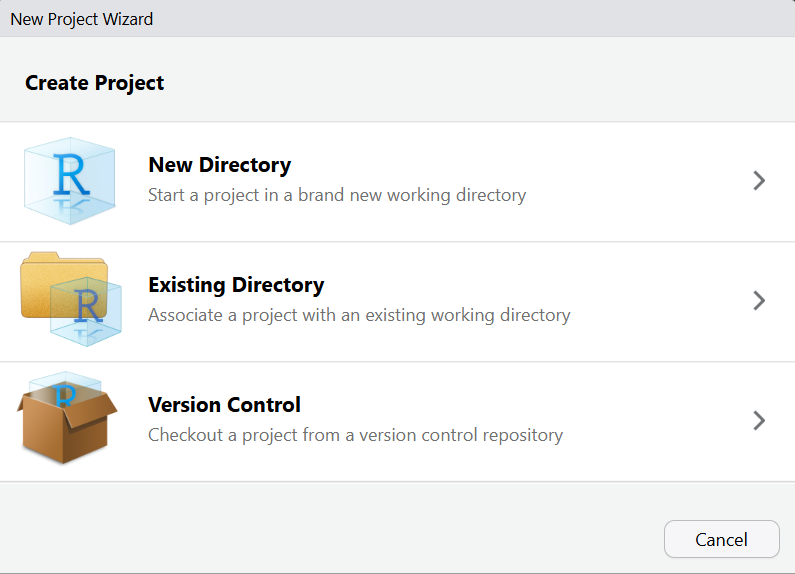
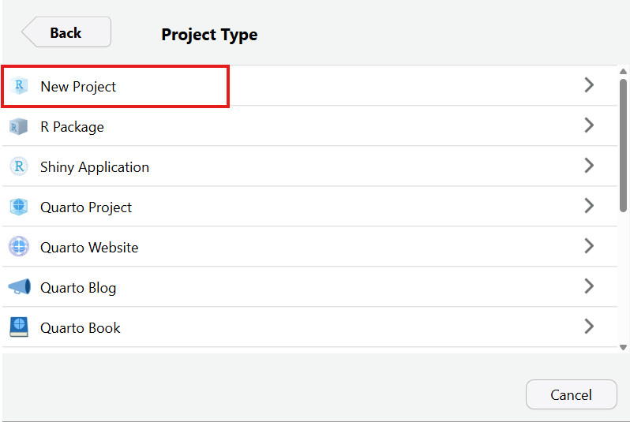
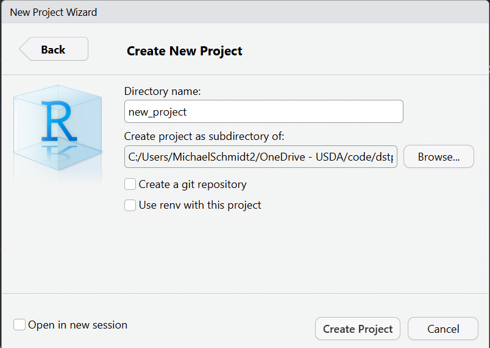
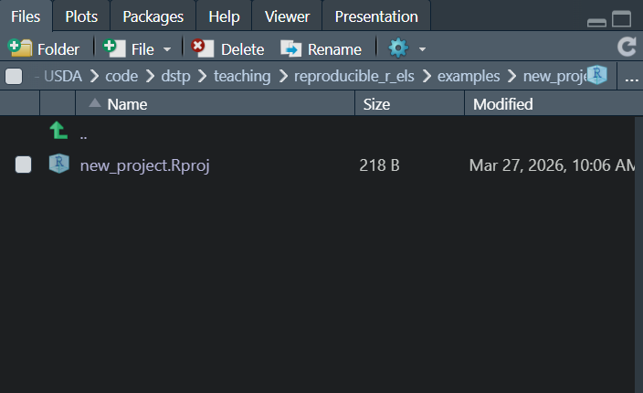
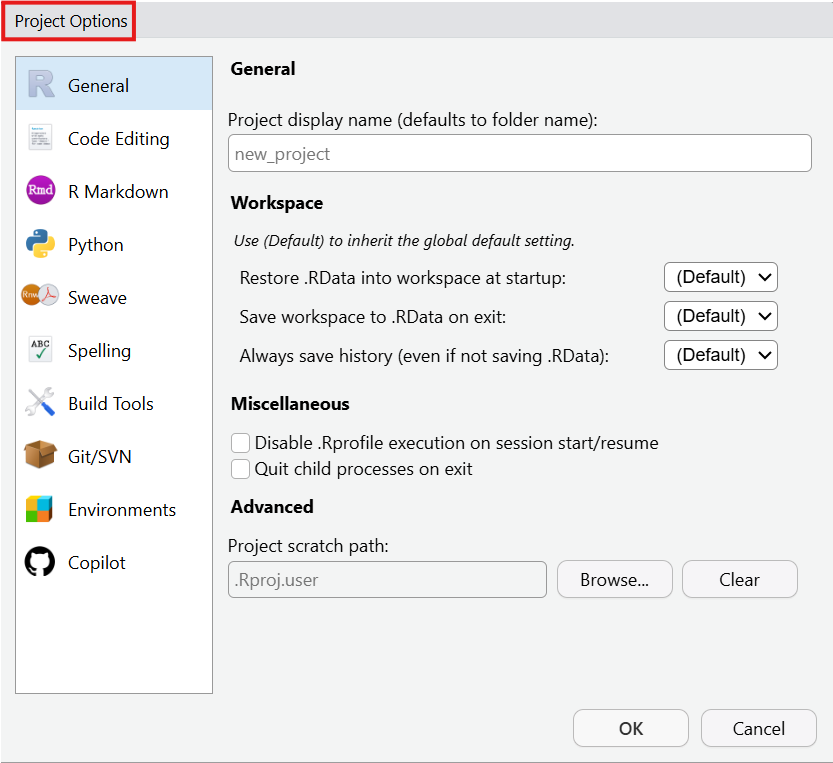
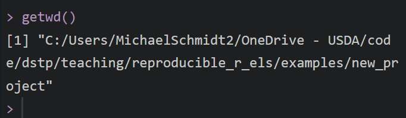
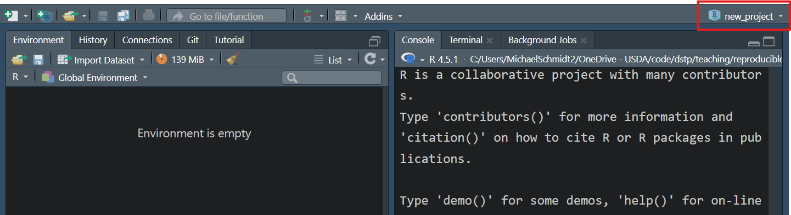

## Overview

!! Fill out when done

## Reproducibility: Why?

Programming helps us perform tasks efficiently and in an explainable, repeatable way.

**Reproducibility** is a framework that helps us work towards the "explainable" and "repeatable" goals.

-   There are many R-based tools that you can use to enhance the reproducibility of your work.

"*Can someone understand and repeat what I've done?*"

## Reproducibility: What?

Reproducibility is:
 
1.  Writing scripts so they are usable by more than one person.
2.  Writing scripts so they will work across systems (etc. R version, OS, package versions, etc.)
3.  Writing scripts so that they are data source and file path agnostic! (`setwd()` no more)

## An introduction to Reproducibility: File Paths

To begin our journey towards reproduciblity let's first discuss file paths.

-   If you open a standalone script, most IDEs (Rstudio and VS Code) start relative to %USERPROFILE% root. On a Windows machine that would be "C://Users/username".
-   To make an R session “relative” to the directory you are working in most of us first learn to use `setwd()`.
-   Even though it is convenient, a good step towards reproducibility is to stop using `setwd()`.

## An introduction to Reproducibility: Why no `setwd()`

-   Reproducibility at its core is making your programs run without editing.
-   So if you share a script and another person has to change `setwd("/c/Users/michaelschmidt/proj/folder/loc")` to `setwd("/c/Users/andrewbrown/different/proj/folder/location")`.
-   While this is small it is a good first step towards reproducibility.

## But how do I not use `setwd()`?

There are a few options:

-   The `{here}` package has the `here()` function to create file paths as well as a helper file, `.here` to set the base of a project (this inconsistently works for me). `{here}` can also be helpful in understanding where you are in a project.
-   My preferred choice is to use R projects (.Rproj file) in RStudio with the GUI or from the console with `usethis::create_project()`

## Reference to RStudio Projects ELS

- Placeholder for reference to RStudio Projects ELS (04/02/2026)

## Rstudio Setup with R Projects: Global Options

Under Tools\>Global Options: In the General tab

This ensures that every R session is fresh on start up with no history to mess up any given script or project.

## R Projects

To create a project go to File \> New Project. 

## R Projects

Select "New Project" 

## R Projects

Browse to select a parent folder and project folder name then select Create Project. 

Alternately, you can create a project from an existing directory.

## R Projects

The project should open in RStudio and you should see an empty project with an .Rproj file. 

## R Projects

If you click on that file you will have an options window that has options similar to the Global options: 

## R Projects

Your R session is now relative to your R project parent folder, and you never need to `setwd()` again so long as your project is active. 

## R Projects

If you are no longer working in the project and want to initialize it in RStudio go to File\>Open Project, File\>Recent Projects or navigate in explorer to the .Rproj file and double click it to open the project in RStudio.

You will know you are working in a R project when you see it set in the upper right corn of your Rstudio session.

## R Projects

-   Now that we've created an R project, and it is active, we can create and write scripts as we otherwise would.
-   Important note: if the project is active, and you are working on a script in a folder outside the project folder, R will still be relative to the active project's root.

## R Projects: next steps

Now that we have relative file paths, and we know the next user of our scripts.

a.  Git
b.  renv

## Git

Version control allows you to track incremental changes in your project, revert back to prior project states, manage multiple users collaborating in a shared code base.

## {renv}

What {renv} does:

-   private library of packages for each project.
-   lockfile (renv.lock) that records the exact version of every package you used.

When a collaborator opens the project, {renv} can use the lockfile to install the exact same package versions, guaranteeing the R environment is "identical."

Basic Workflow:

-   `renv::init()`: Start using renv in a project.
-   `install.packages("some_package")`: Work as you normally would.
-   `renv::snapshot()`: Save the state of your library to renv.lock.
-   (For your collaborators): `renv::restore()`: Install packages from the renv.lock file.

## Packages

### Reference to R Packages ELS

- Placeholder for reference to R Packages ELS (04/02/2026)

a.  maybe outside the scope but definitely should be mentioned as a tool for reproducibility
    a.  I think we can link to/lean on the other ELS that was done on R package development for a lot of the details
    b.  For reproducibility ELS can reiterate how packages
        a.  allow for better compartmentalization of components of your scripts
        b.  provide a mechanism for documentation (.Rd files/roxygen2), versioning and declaring dependencies (DESCRIPTION), and distribution of code (CRAN, r-universe, GitHub)
    c.  Functions you define in packages preferably should be ones that you could re-use in multiple different projects.
        a.  Rather than re-implementing or maintaining multiple copies of R scripts that do the same thing, you can just load the latest version of the package.
        b.  Thinking about how to generalize parts of your scripts so that they are re-usable is an important part of reproducibility.

## Docker

## Targets

## Examples

a.  R targets pipeline
